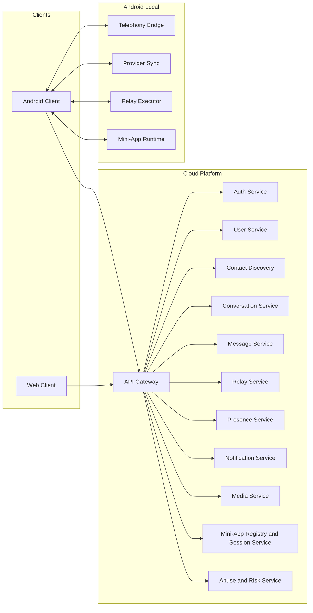
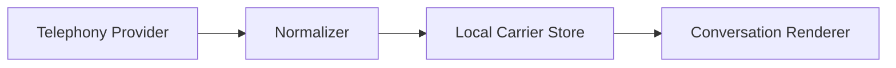
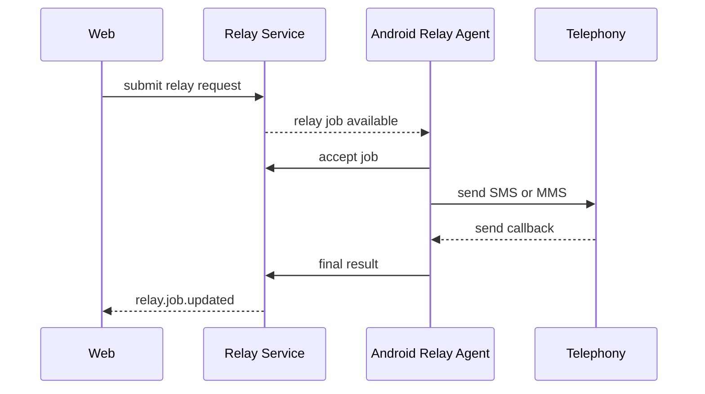
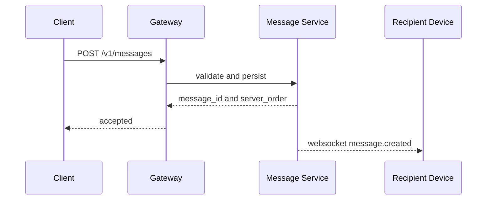
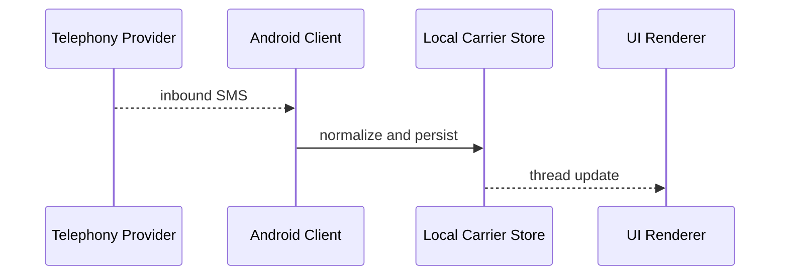
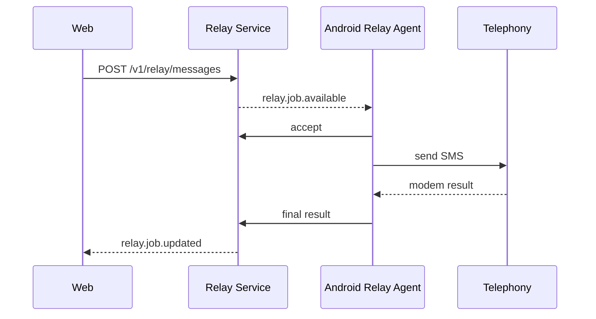
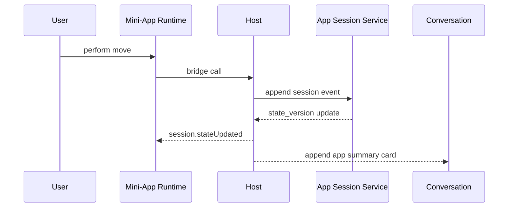

# Open Hybrid Messaging Framework (OHMF)
## Complete Platform Specification

**Specification Version:** 1.0 Draft  
**Document Status:** Proposed Standard  
**Audience:** Framework maintainers, Android and web client engineers, backend and API engineers, mini-app SDK authors, security reviewers, product architects  
**Recommended Licensing Model:** Apache-2.0 for framework code, MIT for example apps, CC-BY-4.0 for documentation

---

## Document Control

| Field | Value |
|---|---|
| Short name | OHMF |
| Full name | Open Hybrid Messaging Framework |
| Primary targets | Android, Web |
| Core modes | OTT messaging, Android SMS/MMS, linked-device carrier relay, embedded mini-apps |
| Canonical document type | Platform specification |
| Normative language | MUST, MUST NOT, SHOULD, SHOULD NOT, MAY |

---

## Table of Contents

1. Purpose and Scope  
2. Conformance and Normative Language  
3. Design Principles  
4. Terminology  
5. High-Level Architecture  
6. Product Operating Modes  
7. Identity and Account Model  
8. Device Model  
9. Contact Discovery  
10. Conversation Model  
11. Message Model  
12. Transport Model  
13. Envelope and Event Model  
14. Message Lifecycle  
15. Editing, Reactions, Receipts, and Presence  
16. Blocking, Visibility, and Client Nicknames  
17. Privacy-Aware Deletion and Data Erasure  
18. Media and Attachment Handling  
19. Backend Services  
20. Data Storage Architecture  
21. Realtime Architecture  
22. REST API  
23. WebSocket Protocol  
24. Protobuf Transport Schemas  
25. Database Schema  
26. Client Sync Model  
27. Android SMS/MMS Integration  
28. Linked-Device Relay  
29. Unified Conversation Rendering  
30. Mini-App Platform  
31. Mini-App SDK and Host Bridge  
32. Security and Abuse Controls  
33. Observability and Operations  
34. Versioning and Compatibility  
35. Repository Layout  
36. Reference Implementation Roadmap  
37. Threat Model Overview  
38. Reference Flow Diagrams  
39. Appendices

---

# 1. Purpose and Scope

OHMF defines an open architecture and protocol for building a **hybrid messaging system** that unifies:

- internet-backed messaging between OHMF users
- Android SMS/MMS messaging when the Android client is the default SMS handler
- web-originated carrier messaging through a trusted linked Android device
- embedded mini-apps and conversation-scoped applications

OHMF separates four concerns that are often incorrectly coupled in messenger implementations:

1. **identity**
2. **conversation timeline state**
3. **transport selection and execution**
4. **embedded application runtime**

This specification defines a complete platform contract for:

- backend services
- Android and web clients
- synchronization behavior
- message lifecycle rules
- deletion and privacy semantics
- mini-app packaging and runtime permissions

### 1.1 In scope

OHMF specifies:

- identity and device registration
- conversation and message models
- OTT message delivery semantics
- Android SMS/MMS import and local authority model
- linked-device relay architecture
- realtime events and synchronization
- data erasure architecture
- mini-app runtime and bridge API

### 1.2 Out of scope

OHMF does not define:

- native RCS implementation by third-party apps
- telecom protocol internals below Android platform abstractions
- browser modem access
- unrestricted plugin/native extension execution
- mandatory end-to-end encryption scheme for all deployments

---

# 2. Conformance and Normative Language

The key words **MUST**, **MUST NOT**, **REQUIRED**, **SHALL**, **SHALL NOT**, **SHOULD**, **SHOULD NOT**, **RECOMMENDED**, **NOT RECOMMENDED**, **MAY**, and **OPTIONAL** in this document are to be interpreted as normative requirement levels.

An implementation conforms to OHMF if it satisfies all mandatory requirements in sections applicable to the features it claims to support.

### 2.1 Feature profiles

An implementation MAY claim conformance for one or more of the following profiles:

- `CORE_OTT`
- `ANDROID_CARRIER`
- `WEB_RELAY`
- `MINIAPP_RUNTIME`

A profile MUST NOT be claimed unless all of its required sections are implemented.

---

# 3. Design Principles

## 3.1 Transport-agnostic timeline

A conversation timeline MUST be modeled independently from the transport used to deliver any given message.

## 3.2 Device-authoritative carrier messaging

Android SMS/MMS state MUST be device-local authoritative. Server state MUST NOT overwrite telephony provider truth.

## 3.3 Deterministic ordering

Every canonical conversation MUST maintain a monotonic ordering key for replay, sync, and deletion reconciliation.

## 3.4 Privacy-aware erasure

Deletion MUST remove personal data while preserving enough structure to maintain timeline integrity and cross-device convergence.

## 3.5 Sandboxed extensibility

Embedded mini-apps MUST operate within a constrained host runtime and MUST receive only explicit capabilities.

## 3.6 Explicit source boundaries

The system MUST distinguish between:

- server-canonical OTT data
- Android-local carrier data
- optional mirrored carrier data
- client-private local presentation data

---

# 4. Terminology

| Term | Meaning |
|---|---|
| OTT | Internet-backed messaging over OHMF services |
| Carrier message | SMS or MMS routed through Android telephony |
| Linked device | A user-owned device attached to the same account |
| Relay | A web-originated carrier send executed by Android |
| Envelope | Top-level transport wrapper for a persisted or realtime event |
| Content payload | Typed body of a message such as `text`, `media`, `app_card`, or `app_event` |
| Mini-app | Sandboxed conversation-scoped application or game |
| App session | Runtime instance of a mini-app bound to a conversation and participant set |
| Capability | Explicit permission granted by the host to a mini-app |
| Visibility state | Current lifecycle state controlling how a message is rendered and whether content remains present |
| Redaction | Removal or nullification of personal content while preserving structural identifiers |
| Purge | Physical deletion of previously redacted data from canonical storage |
| Thread key | A transport- or platform-specific identity used for grouping messages, such as a phone number or Android thread ID |

---

# 5. High-Level Architecture



## 5.1 Architectural layers

### Client layer

- Android client
- web client

### Cloud platform layer

- account, conversation, message, relay, presence, media, and mini-app services

### Android local system layer

- telephony provider access
- SMS/MMS send and receive
- relay execution
- optional local-only carrier storage and rendering

### Extensibility layer

- mini-app registry
- mini-app runtime host
- bridge protocol

---

# 6. Product Operating Modes

## 6.1 Mode matrix

| Capability | Android OTT-only | Android default SMS handler | Web |
|---|---:|---:|---:|
| App-to-app chat | Yes | Yes | Yes |
| Group chat | Yes | Yes | Yes |
| OTT media | Yes | Yes | Yes |
| SMS send | Optional handoff only | Yes | Via linked Android relay |
| SMS receive | No | Yes | Mirrored only if enabled |
| MMS send | Optional handoff only | Yes | Via linked Android relay |
| MMS receive | No | Yes | Mirrored only if enabled |
| Carrier history import | No | Yes | No |
| Mini-app runtime | Yes | Yes | Yes |

## 6.2 Android client modes

- `OTT_ONLY`
- `DEFAULT_SMS_HANDLER`

The Android client MUST NOT claim carrier messaging support unless it holds the default SMS role and the platform permits the required telephony behaviors.

## 6.3 Carrier mirroring modes

- `NONE`
- `METADATA_ONLY`
- `FULL_CONTENT`
- `SELECTIVE`

The default RECOMMENDED policy is `NONE`.

---

# 7. Identity and Account Model

## 7.1 Identity assumptions

A phone number in OHMF is a **verified identifier claim**, not the entire account. Ownership is established by OTP verification. Implementations SHOULD support additional future factors such as passkeys or trusted-device confirmation.

## 7.2 User schema

```json
{
  "user_id": "usr_01JXYZ...",
  "primary_phone_e164": "+15551234567",
  "phone_verified_at": "2026-03-06T17:10:22Z",
  "profile": {
    "display_name": "James",
    "avatar_url": "https://cdn.example/avatar.jpg"
  },
  "settings": {
    "default_send_policy": "AUTO",
    "allow_contact_discovery": true,
    "allow_web_sms_relay": true,
    "carrier_mirroring_policy": "NONE"
  }
}
```

## 7.3 Account lifecycle

An OHMF account MUST support:

- registration by OTP challenge
- device registration
- session refresh
- logout and device revocation
- account deletion request
- export request

## 7.4 OTP requirements

OTP flows MUST enforce:

- short-lived challenges
- one-time use
- rate limits by phone, IP, subnet, and device risk signals
- challenge escalation for suspicious activity

---

# 8. Device Model

## 8.1 Device schema

```json
{
  "device_id": "dev_01JXYZ...",
  "user_id": "usr_01JXYZ...",
  "platform": "ANDROID",
  "device_name": "Pixel 9 Pro",
  "client_version": "1.2.0",
  "capabilities": ["OTT", "PUSH", "MINI_APPS", "SMS_HANDLER"],
  "sms_role_state": "HELD",
  "push_token": "fcm:....",
  "public_key": "base64-encoded-ed25519-pubkey",
  "last_seen_at": "2026-03-06T17:22:00Z"
}
```

## 8.2 Device capabilities

Capabilities MAY include:

- `OTT`
- `PUSH`
- `MINI_APPS`
- `SMS_HANDLER`
- `RELAY_EXECUTOR`

The server MUST NOT dispatch relay jobs to devices that do not expose the necessary capability set.

---

# 9. Contact Discovery

## 9.1 Privacy model

Contacts MUST NOT be uploaded in plaintext for discovery. Implementations SHOULD use blinded or hashed matching and SHOULD support future migration to PSI-style protocols.

## 9.2 Discovery request

```json
{
  "algorithm": "SHA256_PEPPERED_V1",
  "contacts": [
    {"hash": "hex-hash-1", "label": "Alex"},
    {"hash": "hex-hash-2", "label": "Mom"}
  ]
}
```

## 9.3 Discovery response

```json
{
  "matches": [
    {"hash": "hex-hash-1", "user_id": "usr_02", "display_name": "Alex"}
  ]
}
```

---

# 10. Conversation Model

## 10.1 Canonical conversation

A conversation is the primary logical thread entity. Messages belong to conversations, not directly to user pairs.

```json
{
  "conversation_id": "cnv_01JXYZ...",
  "type": "DM",
  "participants": ["usr_01A", "usr_01B"],
  "transport_policy": "AUTO",
  "title": null,
  "created_at": "2026-03-06T16:10:00Z",
  "updated_at": "2026-03-06T17:00:00Z"
}
```

## 10.2 Conversation types

- `DM`
- `GROUP`
- `SYSTEM`
- `APP_SESSION`

## 10.3 Conversation transport policy

Allowed values:

- `AUTO`
- `FORCE_OTT`
- `FORCE_SMS`
- `FORCE_MMS`
- `BLOCK_CARRIER_RELAY`

## 10.4 Thread keys

The platform MUST support transport-specific thread keys without collapsing them into canonical identity blindly.

```json
{
  "thread_keys": [
    {"kind": "conversation_id", "value": "cnv_01"},
    {"kind": "phone_number", "value": "+15557654321"},
    {"kind": "android_thread_id", "value": "222"}
  ]
}
```

---

# 11. Message Model

## 11.1 Canonical message schema

```json
{
  "message_id": "msg_01JXYZ...",
  "conversation_id": "cnv_01JXYZ...",
  "server_order": 455,
  "sender": {
    "user_id": "usr_01A",
    "device_id": "dev_01A"
  },
  "transport": "OTT",
  "content_type": "text",
  "content": {"text": "hello"},
  "client_generated_id": "cmsg_123",
  "created_at": "2026-03-06T17:00:01Z",
  "edited_at": null,
  "deleted_at": null,
  "redacted_at": null,
  "visibility_state": "ACTIVE",
  "metadata": {
    "reply_to_message_id": null,
    "mentions": []
  }
}
```

## 11.2 Content types

OHMF MUST support typed payloads. Recommended standard types:

- `text`
- `rich_text`
- `media`
- `app_card`
- `app_event`
- `system`

## 11.3 Carrier metadata extension

```json
{
  "carrier": {
    "android_local_id": "98765",
    "subscription_id": 1,
    "thread_id": "222",
    "address": "+15557654321",
    "pdu_count": 2,
    "part_count": 1,
    "mms_transaction_id": null
  }
}
```

---

# 12. Transport Model

## 12.1 Supported transports

- `OTT`
- `SMS`
- `MMS`
- `RELAY_SMS`
- `RELAY_MMS`

## 12.2 Transport selection policy

```text
if recipient has active OHMF identity and policy != FORCE_SMS:
    transport = OTT
else if client == Android and app_mode == DEFAULT_SMS_HANDLER:
    transport = SMS or MMS
else if client == Web and linked_android_available:
    transport = RELAY_SMS or RELAY_MMS
else:
    fail with transport_unavailable
```

## 12.3 Delivery records

Delivery MUST be represented separately from the canonical message.

```json
{
  "delivery_id": "del_01...",
  "message_id": "msg_01...",
  "recipient_user_id": "usr_B",
  "recipient_device_id": "dev_B1",
  "transport": "OTT",
  "state": "DELIVERED",
  "submitted_at": "2026-03-08T23:01:15Z",
  "updated_at": "2026-03-08T23:01:16Z"
}
```

---

# 13. Envelope and Event Model

All persisted and realtime events SHOULD use a versioned envelope.

```json
{
  "spec_version": "2026-03-01",
  "event_id": "evt_01JXYZ...",
  "event_type": "message.create",
  "issued_at": "2026-03-06T17:05:11.212Z",
  "actor": {
    "user_id": "usr_01A",
    "device_id": "dev_01A"
  },
  "conversation_id": "cnv_01JXYZ...",
  "transport": "OTT",
  "idempotency_key": "9c130c55-e208-421f-a70e-085a12345678",
  "payload": {},
  "trace": {
    "request_id": "req_...",
    "correlation_id": "corr_..."
  }
}
```

## 13.1 Envelope requirements

- `spec_version` is REQUIRED
- `event_id` is server-assigned for accepted events
- `idempotency_key` is REQUIRED for mutating actions
- unknown fields SHOULD be ignored unless explicitly marked critical

## 13.2 Core event types

- `message.create`
- `message.edit`
- `message.delete`
- `message.redact`
- `reaction.add`
- `reaction.remove`
- `typing.started`
- `typing.stopped`
- `receipt.read`
- `relay.job.updated`
- `app.session.updated`

---

# 14. Message Lifecycle

## 14.1 OTT lifecycle

```text
QUEUED -> ACCEPTED -> STORED -> PUSHED -> DELIVERED -> READ
                         \-> FAILED
```

## 14.2 SMS/MMS lifecycle

```text
PENDING_LOCAL -> SENT_TO_MODEM -> SENT_TO_CARRIER -> DELIVERED(optional)
                     \-> FAILED_LOCAL
                     \-> FAILED_CARRIER
```

## 14.3 Relay lifecycle

```text
QUEUED_ON_SERVER -> DISPATCHED_TO_ANDROID -> ACCEPTED_BY_DEVICE -> SENT_TO_MODEM -> FINAL
                                     \-> DEVICE_OFFLINE
                                     \-> ROLE_NOT_HELD
```

## 14.4 Ordering guarantees

Canonical conversations MUST use a monotonic `server_order` assigned by the Message Service. Carrier-local messages MAY use provider timestamps and provider IDs for local ordering but MUST NOT pretend to have canonical `server_order` unless explicitly mirrored as canonical events.

---

# 15. Editing, Reactions, Receipts, and Presence

## 15.1 Editing

Only the original sender MAY edit a message unless product policy defines additional moderator-like powers.

Edit requests:

```json
{
  "content": {"text": "Want to play tonight?"}
}
```

The server MUST:

1. verify permission
2. update current visible content
3. set `edited_at`
4. increment revision
5. emit a `message.updated` event

Optional edit history MAY be stored in a side table.

## 15.2 Reactions

Reactions are separate records and MUST NOT be stored by mutating original content payloads.

```json
{
  "message_id": "msg_01",
  "user_id": "usr_02",
  "emoji": "🎱",
  "created_at": "2026-03-08T23:03:00Z",
  "removed_at": null
}
```

## 15.3 Read receipts

Read receipts SHOULD be conversation-scoped and SHOULD use a watermark model.

```json
{
  "conversation_id": "cnv_01",
  "user_id": "usr_02",
  "through_server_order": 456
}
```

## 15.4 Typing indicators

Typing state MUST be ephemeral and MUST NOT be persisted to canonical history. TTL of approximately five seconds is RECOMMENDED.

## 15.5 Presence

Presence MUST be treated as ephemeral hot state, not durable history. A cache store such as Redis is RECOMMENDED.

---

# 16. Blocking, Visibility, and Client Nicknames

## 16.1 Blocking

A block rule has at least two dimensions:

- delivery prohibition
- visibility filtering

```json
{
  "blocker_user_id": "usr_A",
  "blocked_user_id": "usr_B",
  "created_at": "2026-03-08T23:00:00Z"
}
```

## 16.2 Block effects

When A blocks B:

- B MUST NOT be able to DM A
- A MUST NOT receive B's typing indicators
- A SHOULD NOT receive B's reaction events
- A's rendering pipeline MAY hide B entirely in group views depending on product policy

## 16.3 Client-only nicknames

Client-only nicknames SHOULD default to local storage and SHOULD NOT require server persistence.

```json
{
  "target_user_id": "usr_B",
  "nickname": "Work Bob",
  "scope": "LOCAL_ONLY"
}
```

---

# 17. Privacy-Aware Deletion and Data Erasure

## 17.1 Deletion philosophy

OHMF uses **ID-preserving redaction** as the primary deletion mechanism for canonical messaging records. This allows the platform to remove personal data while preserving conversation order and synchronization integrity.

## 17.2 Visibility states

- `ACTIVE`
- `EDITED`
- `SOFT_DELETED`
- `REDACTED`
- `PURGED`

## 17.3 Message deletion flow

1. emit deletion event
2. mark `deleted_at`
3. redact content fields
4. delete attachments and derived assets
5. invalidate caches and indexes
6. optionally purge after retention delay

### Example redacted record

```json
{
  "message_id": "msg_01",
  "conversation_id": "cnv_01",
  "server_order": 455,
  "sender": null,
  "transport": "OTT",
  "content_type": "text",
  "content": null,
  "created_at": "2026-03-06T17:00:01Z",
  "deleted_at": "2026-03-08T23:10:00Z",
  "redacted_at": "2026-03-08T23:10:01Z",
  "visibility_state": "REDACTED"
}
```

## 17.4 Data removed during redaction

Redaction SHOULD remove or nullify:

- message body
- quoted previews
- attachment object keys
- sender metadata where policy requires
- edit-history payloads
- search index bodies

## 17.5 Data preserved during redaction

- `message_id`
- `conversation_id`
- `server_order`
- timestamps
- minimal non-personal audit markers

## 17.6 Account deletion

Account deletion MUST remove:

- phone identity mappings
- session tokens
- devices
- profile fields
- avatars
- discovery indexes

Authored group-history messages MAY be anonymized rather than physically removed if required to preserve group timeline integrity.

---

# 18. Media and Attachment Handling

## 18.1 OTT media flow

1. client requests upload authorization
2. client uploads to object storage
3. client confirms completion
4. media record is attached to message payload

## 18.2 Media payload example

```json
{
  "content_type": "media",
  "content": {
    "items": [
      {
        "media_id": "med_01",
        "kind": "image",
        "mime_type": "image/jpeg",
        "bytes": 242112,
        "width": 1280,
        "height": 720,
        "sha256": "..."
      }
    ],
    "caption": "Tonight"
  }
}
```

## 18.3 MMS media

Carrier MMS media MUST remain device-local unless mirrored under explicit user policy. Downscaled or transformed mirrors MAY be stored only when policy allows it.

---

# 19. Backend Services

## 19.1 API Gateway

Responsibilities:

- auth enforcement
- routing
- rate limiting
- version negotiation

## 19.2 Auth Service

Responsibilities:

- phone verification
- token issuance
- device registration
- refresh and revocation

## 19.3 User Service

Responsibilities:

- profiles
- settings
- device inventory

## 19.4 Contact Discovery

Responsibilities:

- blinded lookup
- normalization to E.164
- privacy-preserving matching

## 19.5 Conversation Service

Responsibilities:

- thread creation
- membership
- transport policy
- conversation metadata

## 19.6 Message Service

Responsibilities:

- canonical message persistence
- `server_order` assignment
- edits, reactions, receipts, deletion events

## 19.7 Relay Service

Responsibilities:

- relay job queueing
- Android device selection
- relay status tracking
- failure state reporting

## 19.8 Presence Service

Responsibilities:

- presence registry
- typing state fanout
- ephemeral socket mapping

## 19.9 Notification Service

Responsibilities:

- push fan-out
- notification suppression logic

## 19.10 Media Service

Responsibilities:

- upload tokens
- object lifecycle
- derivative processing

## 19.11 Mini-App Registry and Session Service

Responsibilities:

- manifest registration
- signature validation
- session creation
- state versioning
- snapshot persistence

## 19.12 Abuse and Risk Service

Responsibilities:

- OTP throttling
- message abuse scoring
- relay abuse prevention
- mini-app quotas and moderation

---

# 20. Data Storage Architecture

## 20.1 Recommended stores

| Concern | Recommended store |
|---|---|
| user, conversation, canonical message metadata | PostgreSQL |
| hot presence and typing state | Redis |
| media objects | S3-compatible object storage |
| async job/event pipeline | Kafka, RabbitMQ, or equivalent |
| logs and metrics | structured log store + metrics system |

## 20.2 Source-of-truth rules

| Data category | Source of truth |
|---|---|
| OTT conversations and messages | Server |
| Android SMS/MMS content and provider state | Android device |
| Mirrored carrier content | Device-authoritative, server as replicated mirror |
| client-only nicknames | Client-local storage |

---

# 21. Realtime Architecture

## 21.1 Realtime transport

WebSocket is RECOMMENDED for realtime event delivery.

Endpoint example:

```text
wss://api.example.com/v1/realtime?access_token=...
```

## 21.2 Realtime event examples

```json
{"type":"message.created","payload":{...}}
{"type":"message.updated","payload":{...}}
{"type":"typing.started","payload":{"conversation_id":"cnv_01","user_id":"usr_02"}}
{"type":"receipt.read","payload":{"conversation_id":"cnv_01","user_id":"usr_02","through_server_order":456}}
{"type":"relay.job.updated","payload":{"relay_job_id":"rly_01","status":"DISPATCHED_TO_ANDROID"}}
{"type":"app.session.updated","payload":{"app_session_id":"aps_01","state_version":43}}
```

## 21.3 Ordering rules

- `server_order` is monotonic per conversation
- event delivery MAY be out of order across conversations
- clients MUST dedupe using `event_id` and resource identifiers

---

# 22. REST API

Base path:

```text
/v1/
```

## 22.1 Authentication endpoints

### POST `/auth/phone/start`

Request:

```json
{
  "phone_e164": "+15551234567",
  "channel": "SMS",
  "client": {
    "platform": "ANDROID",
    "app_version": "1.2.0",
    "device_fingerprint": "optional-risk-signal"
  }
}
```

Response:

```json
{
  "challenge_id": "chl_01J...",
  "expires_in_sec": 300,
  "retry_after_sec": 30,
  "otp_strategy": "SMS"
}
```

### POST `/auth/phone/verify`

Request:

```json
{
  "challenge_id": "chl_01J...",
  "otp_code": "123456",
  "device": {
    "platform": "ANDROID",
    "device_name": "Pixel 9 Pro",
    "push_token": "fcm:....",
    "public_key": "base64-ed25519-pubkey"
  }
}
```

Response:

```json
{
  "user": {"user_id": "usr_01", "primary_phone_e164": "+15551234567"},
  "device": {"device_id": "dev_01", "platform": "ANDROID"},
  "tokens": {"access_token": "jwt-or-paseto", "refresh_token": "opaque-or-rotating"}
}
```

### POST `/auth/refresh`

### POST `/auth/logout`

## 22.2 Contact discovery

### POST `/contacts/discover`

See Section 9.

## 22.3 Conversation APIs

### POST `/conversations`

```json
{
  "type": "DM",
  "participants": ["usr_02"],
  "transport_policy": "AUTO"
}
```

### GET `/conversations`

### GET `/conversations/{conversation_id}`

### PATCH `/conversations/{conversation_id}`

```json
{
  "transport_policy": "FORCE_SMS"
}
```

## 22.4 Message APIs

### POST `/messages`

```json
{
  "conversation_id": "cnv_01",
  "idempotency_key": "uuid",
  "content_type": "text",
  "content": {"text": "Want to play?"},
  "client_generated_id": "tmp_1001"
}
```

### GET `/conversations/{conversation_id}/messages`

### PATCH `/messages/{message_id}`

### DELETE `/messages/{message_id}`

### POST `/messages/{message_id}/reactions`

```json
{"emoji": "🎱"}
```

### POST `/conversations/{conversation_id}/read`

```json
{"through_server_order": 456}
```

## 22.5 Media APIs

### POST `/media/uploads`

### POST `/media/uploads/{upload_id}/complete`

## 22.6 Relay APIs

### POST `/relay/messages`

```json
{
  "destination": {"phone_e164": "+15557654321"},
  "transport_hint": "SMS",
  "content_type": "text",
  "content": {"text": "On my way"}
}
```

### GET `/relay/jobs/{relay_job_id}`

### POST `/relay/jobs/{relay_job_id}/accept`

### POST `/relay/jobs/{relay_job_id}/result`

## 22.7 Mini-app APIs

### POST `/apps/sessions`

### GET `/apps/sessions/{app_session_id}`

### POST `/apps/sessions/{app_session_id}/events`

### POST `/apps/sessions/{app_session_id}/snapshot`

### POST `/apps/register`

### GET `/apps/{app_id}`

### GET `/apps`

---

# 23. WebSocket Protocol

## 23.1 Subscription message

```json
{
  "type": "subscribe",
  "conversation_ids": ["cnv_01", "cnv_02"]
}
```

## 23.2 Deduplication requirements

Clients MUST dedupe websocket-delivered mutations using `event_id` and idempotency correlation where applicable.

## 23.3 Reconnect behavior

After reconnect, the client SHOULD resynchronize from its last known sync cursor rather than assuming websocket replay completeness.

---

# 24. Protobuf Transport Schemas

OHMF MAY implement a protobuf-based transport for binary efficiency.

```proto
syntax = "proto3";

message Envelope {
  string spec_version = 1;
  string event_id = 2;
  string event_type = 3;
  string issued_at = 4;
  string conversation_id = 5;
  string transport = 6;
  string idempotency_key = 7;
  bytes payload = 8;
}

message MessageRecord {
  string message_id = 1;
  string conversation_id = 2;
  int64 server_order = 3;
  string sender_user_id = 4;
  string sender_device_id = 5;
  string transport = 6;
  string content_type = 7;
  bytes content = 8;
  int64 created_at_unix_ms = 9;
  int64 edited_at_unix_ms = 10;
  int64 deleted_at_unix_ms = 11;
  int64 redacted_at_unix_ms = 12;
  string visibility_state = 13;
}

message ReadReceipt {
  string conversation_id = 1;
  string user_id = 2;
  int64 through_server_order = 3;
}

message RelayJob {
  string relay_job_id = 1;
  string executing_device_id = 2;
  string transport = 3;
  string status = 4;
  bytes destination = 5;
  bytes content = 6;
}
```

---

# 25. Database Schema

The following PostgreSQL schema is a reference implementation model.

## 25.1 Users

```sql
CREATE TABLE users (
  user_id UUID PRIMARY KEY,
  primary_phone_e164 TEXT UNIQUE,
  phone_verified_at TIMESTAMP,
  display_name TEXT,
  avatar_url TEXT,
  created_at TIMESTAMP NOT NULL DEFAULT now()
);
```

## 25.2 Devices

```sql
CREATE TABLE devices (
  device_id UUID PRIMARY KEY,
  user_id UUID REFERENCES users(user_id),
  platform TEXT NOT NULL,
  device_name TEXT,
  capabilities JSONB NOT NULL DEFAULT '[]'::jsonb,
  public_key TEXT,
  push_token TEXT,
  sms_role_state TEXT,
  last_seen TIMESTAMP
);
```

## 25.3 Conversations

```sql
CREATE TABLE conversations (
  conversation_id UUID PRIMARY KEY,
  type TEXT NOT NULL,
  transport_policy TEXT NOT NULL,
  title TEXT,
  created_at TIMESTAMP NOT NULL,
  updated_at TIMESTAMP NOT NULL
);
```

## 25.4 Conversation participants

```sql
CREATE TABLE conversation_participants (
  conversation_id UUID REFERENCES conversations(conversation_id),
  user_id UUID REFERENCES users(user_id),
  role TEXT,
  joined_at TIMESTAMP,
  left_at TIMESTAMP,
  PRIMARY KEY (conversation_id, user_id)
);
```

## 25.5 Messages

```sql
CREATE TABLE messages (
  message_id UUID PRIMARY KEY,
  conversation_id UUID REFERENCES conversations(conversation_id),
  server_order BIGINT NOT NULL,
  sender_user_id UUID,
  sender_device_id UUID,
  transport TEXT NOT NULL,
  content_type TEXT NOT NULL,
  content JSONB,
  client_generated_id TEXT,
  created_at TIMESTAMP NOT NULL,
  edited_at TIMESTAMP,
  deleted_at TIMESTAMP,
  redacted_at TIMESTAMP,
  visibility_state TEXT NOT NULL
);

CREATE UNIQUE INDEX idx_messages_conversation_order
ON messages(conversation_id, server_order);
```

## 25.6 Message reactions

```sql
CREATE TABLE message_reactions (
  message_id UUID REFERENCES messages(message_id),
  user_id UUID REFERENCES users(user_id),
  emoji TEXT NOT NULL,
  created_at TIMESTAMP NOT NULL,
  removed_at TIMESTAMP,
  PRIMARY KEY (message_id, user_id, emoji)
);
```

## 25.7 Deliveries

```sql
CREATE TABLE message_deliveries (
  delivery_id UUID PRIMARY KEY,
  message_id UUID REFERENCES messages(message_id),
  recipient_user_id UUID,
  recipient_device_id UUID,
  recipient_phone_e164 TEXT,
  transport TEXT NOT NULL,
  state TEXT NOT NULL,
  provider TEXT,
  submitted_at TIMESTAMP,
  updated_at TIMESTAMP NOT NULL,
  failure_code TEXT
);
```

## 25.8 Attachments

```sql
CREATE TABLE attachments (
  attachment_id UUID PRIMARY KEY,
  message_id UUID REFERENCES messages(message_id),
  object_key TEXT,
  thumbnail_key TEXT,
  mime_type TEXT NOT NULL,
  size_bytes BIGINT,
  created_at TIMESTAMP NOT NULL,
  deleted_at TIMESTAMP,
  redacted_at TIMESTAMP
);
```

## 25.9 Blocks

```sql
CREATE TABLE user_blocks (
  blocker_user_id UUID NOT NULL,
  blocked_user_id UUID NOT NULL,
  created_at TIMESTAMP NOT NULL,
  PRIMARY KEY (blocker_user_id, blocked_user_id)
);
```

## 25.10 Mini-app sessions

```sql
CREATE TABLE mini_app_sessions (
  app_session_id UUID PRIMARY KEY,
  conversation_id UUID NOT NULL,
  app_id TEXT NOT NULL,
  state JSONB NOT NULL,
  state_version INT NOT NULL,
  created_by UUID,
  created_at TIMESTAMP NOT NULL
);
```

## 25.11 Mini-app events

```sql
CREATE TABLE mini_app_events (
  app_session_id UUID NOT NULL,
  event_seq INT NOT NULL,
  actor_user_id UUID,
  event_name TEXT NOT NULL,
  body JSONB NOT NULL,
  created_at TIMESTAMP NOT NULL,
  PRIMARY KEY (app_session_id, event_seq)
);
```

---

# 26. Client Sync Model

## 26.1 Sync sources

Clients MUST manage synchronization from three possible sources:

1. canonical OTT server state
2. Android-local carrier provider state
3. optional mirrored carrier server state

## 26.2 Sync cursor

Each client SHOULD track a durable cursor or equivalent watermark.

```json
{
  "conversation_sync_cursor": "opaque-cursor-token"
}
```

## 26.3 Sync endpoint example

```json
{
  "events": [ ... ],
  "next_cursor": "..."
}
```

## 26.4 Local send state machine

```text
DRAFT -> SENDING -> ACKNOWLEDGED -> DELIVERED -> READ
```

## 26.5 Reconnect algorithm

1. restore local cache
2. reopen websocket
3. issue incremental sync from last durable cursor
4. reconcile pending local outbox entries using idempotency keys
5. apply remote events in stable order

---

# 27. Android SMS/MMS Integration

## 27.1 Principles

- carrier messaging support REQUIRES default SMS role
- telephony provider state is authoritative
- SMS/MMS import MUST be local-first
- raw provider IDs SHOULD be preserved where possible

## 27.2 Android module layout

```text
android-app/
  app/
  core/
    auth/
    api/
    db/
    realtime/
    media/
  messaging/
    conversations/
    composer/
    receipts/
  telephony/
    role/
    sms/
    mms/
    provider/
    relay/
  miniapps/
    runtime/
    bridge/
    permissions/
  sync/
    jobs/
    conflict/
```

## 27.3 Telephony components

- role manager adapter
- SMS receiver
- MMS or WAP push receiver
- provider DAO
- SMS sender
- MMS sender wrapper
- carrier-thread normalizer
- relay executor

## 27.4 SMS import pipeline



### Normalized SMS example

```json
{
  "normalized_type": "sms.inbound",
  "received_at": "2026-03-06T17:20:00Z",
  "from": "+15557654321",
  "subscription_id": 1,
  "body": "running late",
  "segments": 1,
  "thread_key": {"kind": "phone_number", "value": "+15557654321"}
}
```

## 27.5 MMS normalization

```json
{
  "normalized_type": "mms.inbound",
  "from": "+15557654321",
  "subject": null,
  "parts": [
    {"kind": "image", "mime_type": "image/jpeg", "provider_part_id": "p123", "filename": "IMG_1002.jpg"},
    {"kind": "text", "text": "look at this"}
  ]
}
```

## 27.6 Parsing principles

- normalize phone numbers to E.164 when feasible
- preserve provider IDs
- preserve raw timestamps in addition to normalized timestamps where useful
- do not assume MMS has a single text body
- do not assume one carrier thread maps one-to-one to an OTT conversation

---

# 28. Linked-Device Relay

## 28.1 Objectives

Linked-device relay allows a web client to request an SMS or MMS send that is executed by a trusted Android device.

## 28.2 Relay job schema

```json
{
  "relay_job_id": "rly_01",
  "requested_by": {"user_id": "usr_01", "device_id": "dev_web_01"},
  "executing_device_id": "dev_android_01",
  "transport": "RELAY_SMS",
  "destination": {"phone_e164": "+15557654321"},
  "content": {"text": "On my way"},
  "status": "QUEUED_ON_SERVER"
}
```

## 28.3 Relay execution flow



## 28.4 Failure codes

- `NO_ELIGIBLE_ANDROID_DEVICE`
- `DEVICE_OFFLINE`
- `SMS_ROLE_NOT_HELD`
- `SEND_PERMISSION_UNAVAILABLE`
- `CARRIER_SEND_FAILED`
- `CONTENT_TOO_LARGE_FOR_SMS`
- `MMS_NOT_CONFIGURED`
- `USER_DISABLED_RELAY`

---

# 29. Unified Conversation Rendering

## 29.1 Rendering objective

The user experience MAY present a unified conversation view combining OTT and carrier data while preserving clear transport boundaries.

### Example timeline

```text
10:01  OTT   James: hello
10:02  SMS   Bob: hi
10:03  MMS   Bob: image.jpg
10:05  OTT   James: 🎱 reaction
```

## 29.2 Rendering sources

The renderer SHOULD support a federated source model:

- cloud canonical messages
- local SMS source
- local MMS source
- optional mirrored carrier source

## 29.3 Merge policy

Recommended merge order:

- primary sort by display timestamp
- secondary sort by transport-specific stable ordering
- render transport separators when source changes

---

# 30. Mini-App Platform

## 30.1 Goals

Mini-apps extend the messenger with conversation-scoped experiences such as:

- turn-based games
- realtime games
- polls
- shared lists
- collaboration utilities

## 30.2 Design principles

- sandboxed execution
- capability-scoped access
- conversation-scoped sessions
- deterministic state versioning
- host-mediated message sending

## 30.3 Mini-app packaging model

Mini-apps SHOULD ship with a signed manifest and static assets or an entry URL.

```json
{
  "app_id": "app.example.eightball",
  "name": "8-Ball",
  "version": "2.1.0",
  "entrypoint": {"type": "web_bundle", "url": "https://apps.example/eightball/index.html"},
  "icons": [{"size": 64, "url": "https://apps.example/eightball/icon-64.png"}],
  "permissions": [
    "conversation.send_message",
    "conversation.read_context",
    "storage.session",
    "realtime.session"
  ],
  "capabilities": {
    "turn_based": true,
    "spectators": false,
    "offline_resume": true
  },
  "signature": {"alg": "Ed25519", "kid": "appkey_01", "sig": "base64..."}
}
```

---

# 31. Mini-App SDK and Host Bridge

## 31.1 Runtime models

### Model A: hosted web runtime

- Android: sandboxed WebView
- Web: sandboxed iframe or equivalent isolated route

This model is RECOMMENDED for initial framework implementations.

## 31.2 Capability model

Recommended permissions:

| Capability | Description |
|---|---|
| `conversation.read_context` | Read bounded thread metadata and recent message window |
| `conversation.send_message` | Send user-approved app messages or events |
| `participants.read_basic` | Read participant IDs, display names, avatar refs |
| `storage.session` | Session-scoped key-value storage |
| `storage.shared_conversation` | Shared app-session storage |
| `realtime.session` | Subscribe to session events |
| `media.pick_user` | Open host media picker with user consent |
| `notifications.in_app` | Surface in-app prompts or badges |

Forbidden by default:

- raw contacts
- raw SMS/MMS access
- arbitrary filesystem access
- unrestricted network to undeclared origins
- device identifiers

## 31.3 Bridge protocol

The host bridge SHOULD follow a JSON-RPC-like request and response model.

Request example:

```json
{
  "bridge_version": "1.0",
  "request_id": "br_01",
  "method": "conversation.sendMessage",
  "params": {
    "content_type": "app_event",
    "content": {
      "app_session_id": "aps_01",
      "event_name": "MOVE",
      "body": {"x": 2, "y": 3}
    }
  }
}
```

Response example:

```json
{
  "request_id": "br_01",
  "ok": true,
  "result": {"message_id": "msg_01"}
}
```

Event pushed to app:

```json
{
  "bridge_event": "session.stateUpdated",
  "payload": {
    "app_session_id": "aps_01",
    "state_version": 43,
    "delta": {"board": {}}
  }
}
```

## 31.4 Launch context

```json
{
  "app_id": "app.example.pool",
  "app_session_id": "aps_01",
  "conversation_id": "cnv_01",
  "viewer": {"user_id": "usr_01", "role": "PLAYER"},
  "participants": [
    {"user_id": "usr_01", "role": "PLAYER"},
    {"user_id": "usr_02", "role": "PLAYER"}
  ],
  "capabilities_granted": [
    "conversation.send_message",
    "conversation.read_context",
    "storage.session",
    "realtime.session"
  ],
  "state_snapshot": {"turn": "usr_02", "score": {"usr_01": 1, "usr_02": 0}}
}
```

## 31.5 Session lifecycle

1. user taps app card or composer action
2. host validates manifest and permissions
3. host creates or resumes app session
4. runtime is launched with launch context
5. app emits events through bridge
6. host persists session deltas and may project summary messages into thread

---

# 32. Security and Abuse Controls

## 32.1 Authentication security

Implementations MUST support:

- OTP rate limits
- challenge expiration
- replay prevention
- device registration verification

## 32.2 Messaging abuse controls

Implementations SHOULD support:

- send rate limits
- destination reputation scoring
- spam reports
- blocklists
- relay anti-automation rules

## 32.3 Mini-app security requirements

- manifests MUST be signed
- host MUST verify origin and signature
- network access MUST be limited to declared origins
- host bridge MUST enforce capability checks
- sensitive actions SHOULD require user gesture or prompt
- apps MUST NOT silently emit unrestricted arbitrary chat messages

## 32.4 Logging requirements

Security-sensitive actions SHOULD be auditable using structured events that do not retain unnecessary personal content.

---

# 33. Observability and Operations

## 33.1 Structured logs

Recommended event families:

- `message.created`
- `message.updated`
- `relay.job.started`
- `relay.job.completed`
- `miniapp.session.started`
- `miniapp.session.updated`
- `auth.challenge.created`
- `auth.challenge.failed`

## 33.2 Metrics

Recommended metrics include:

- messages per second
- relay dispatch latency
- SMS send success rate
- websocket connection count
- delivery latency percentile
- OTP failure rate
- mini-app bridge error rate

## 33.3 Tracing

Correlation IDs SHOULD be propagated through:

- HTTP requests
- websocket-accepted mutations
- relay jobs
- mini-app session events

---

# 34. Versioning and Compatibility

## 34.1 Version layers

OHMF uses multiple version domains:

- API version via path
- `spec_version` in envelopes
- `manifest_version` for mini-app manifests
- `bridge_version` for mini-app host bridge

## 34.2 Compatibility rules

- additive fields are preferred
- content payloads SHOULD use discriminated unions keyed by `content_type`
- breaking field removals require a major version bump
- mini-app bridge methods SHOULD negotiate capability support

---

# 35. Repository Layout

```text
ohmf/
  docs/
    architecture.md
    protocol.md
    android.md
    web.md
    miniapps.md
  packages/
    protocol/
      schemas/
      types/
    sdk-js/
    sdk-kotlin/
    miniapp-sdk/
  services/
    gateway/
    auth/
    users/
    conversations/
    messages/
    realtime/
    media/
    relay/
    apps/
    abuse/
  apps/
    android/
    web/
  examples/
    miniapps/
      darts/
      eightball/
      poll/
  infra/
    docker/
    k8s/
    terraform/
```

---

# 36. Reference Implementation Roadmap

## Phase 1: Core identity and OTT

- auth
- devices
- conversations
- messages
- realtime
- media
- Android and web OTT chat

## Phase 2: Android SMS role mode

- role acquisition UX
- SMS send and receive
- MMS send and receive
- provider import and sync
- transport-aware UI

## Phase 3: Linked-device relay

- Android relay agent
- relay queue and status machine
- web relay UX

## Phase 4: Mini-app runtime

- manifest format
- host bridge
- app sessions
- first-party sample mini-apps

## Phase 5: Hardening

- abuse controls
- richer capability prompts
- encryption roadmap
- open-source release packaging

---

# 37. Threat Model Overview

## 37.1 Primary threat categories

- account takeover via OTP abuse
- message spam and fraud
- unauthorized relay execution
- insecure carrier mirroring
- malicious mini-app exfiltration attempts
- replay and duplication bugs

## 37.2 High-level mitigations

- strong OTP throttling and device risk scoring
- explicit relay trust and capability checks
- default local-only carrier mode
- signed mini-app manifests
- bounded mini-app bridge permissions
- idempotency keys on mutating operations

---

# 38. Reference Flow Diagrams

## 38.1 OTT send flow



## 38.2 Android inbound SMS flow



## 38.3 Web relay SMS flow



## 38.4 Mini-app move flow



---

# 39. Appendices

## Appendix A: Sample system message

```json
{
  "content_type": "system",
  "content": {
    "system_type": "TRANSPORT_SWITCH",
    "text": "Messages to this contact are being sent by SMS"
  }
}
```

## Appendix B: Sample app card

```json
{
  "content_type": "app_card",
  "content": {
    "app_id": "app.example.eightball",
    "app_version": "2.1.0",
    "card_type": "INVITE",
    "title": "8-Ball Challenge",
    "description": "Tap to play inside chat",
    "icon_url": "https://apps.example/eightball/icon.png",
    "app_session_id": "aps_01...",
    "launch_context": {
      "mode": "turn_based",
      "participants": ["usr_01A", "usr_01B"]
    }
  }
}
```

## Appendix C: Error model

```json
{
  "error": {
    "code": "transport_unavailable",
    "message": "No eligible Android device is available for relay SMS",
    "details": {"required_capability": "SMS_HANDLER"},
    "retryable": false
  }
}
```

Common error codes:

- `unauthorized`
- `forbidden`
- `rate_limited`
- `invalid_phone_number`
- `otp_expired`
- `otp_invalid`
- `conversation_not_found`
- `message_not_found`
- `transport_unavailable`
- `relay_unavailable`
- `sms_role_not_held`
- `mms_configuration_missing`
- `miniapp_capability_denied`
- `miniapp_manifest_invalid`
- `idempotency_conflict`
- `unsupported_content_type`

## Appendix D: Final framework stance

The central architectural rule of OHMF is:

> **Identity is phone-number-based, messaging is transport-agnostic, carrier messaging is Android-local by default, and mini-apps are sandboxed conversation-scoped runtimes.**

This rule keeps the framework implementable, privacy-aware, open-source friendly, and aligned with actual Android constraints.
